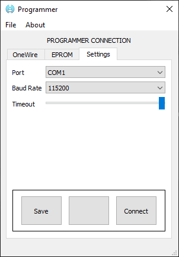
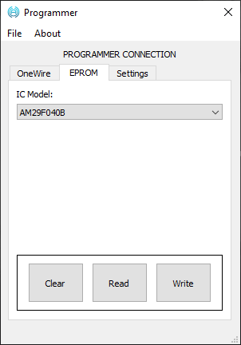
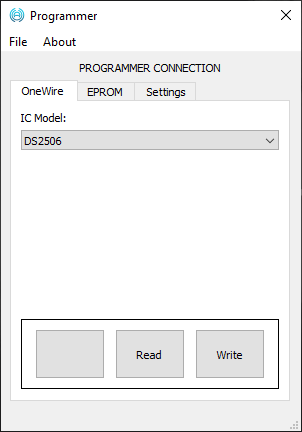
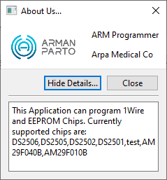

# 2 in 1 Programmer
> This project is actually a combination of 2 projects. I needed a _1Wire programmer_ and also an _EEPROM parallel programmer_. Since I had to use an _Arduino Mega_ board, I had plenty of space and `GPIO` to integrate both in one place :wink:.

You can contact me at [github](https://github.com/monjazeb) or by this [email](mailto:armonj@gmail.com).

***Thanks.***

## 1Wire Programmer
1Wire EEPROM programmer using Arduino. 

## EEPROM Progarmmer
I used [mint64](https://mint64.home.blog/2018/07/29/parallel-nor-flash-eeprom-programmer-using-an-arduino-part-1-the-sst39sf040-and-planning/)'s project as base and added essencial functionalities I needed.

## GUI

## Board

## Todo
- [ ] Complete Readme.md file for help
- [ ] :tada: